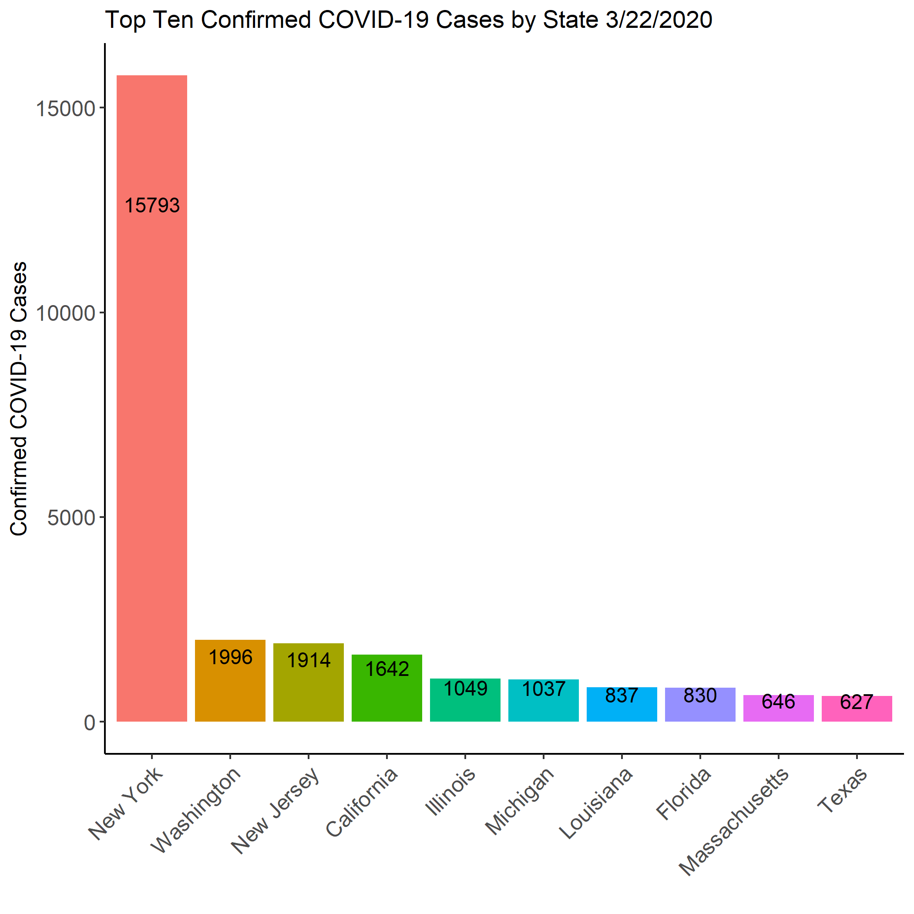
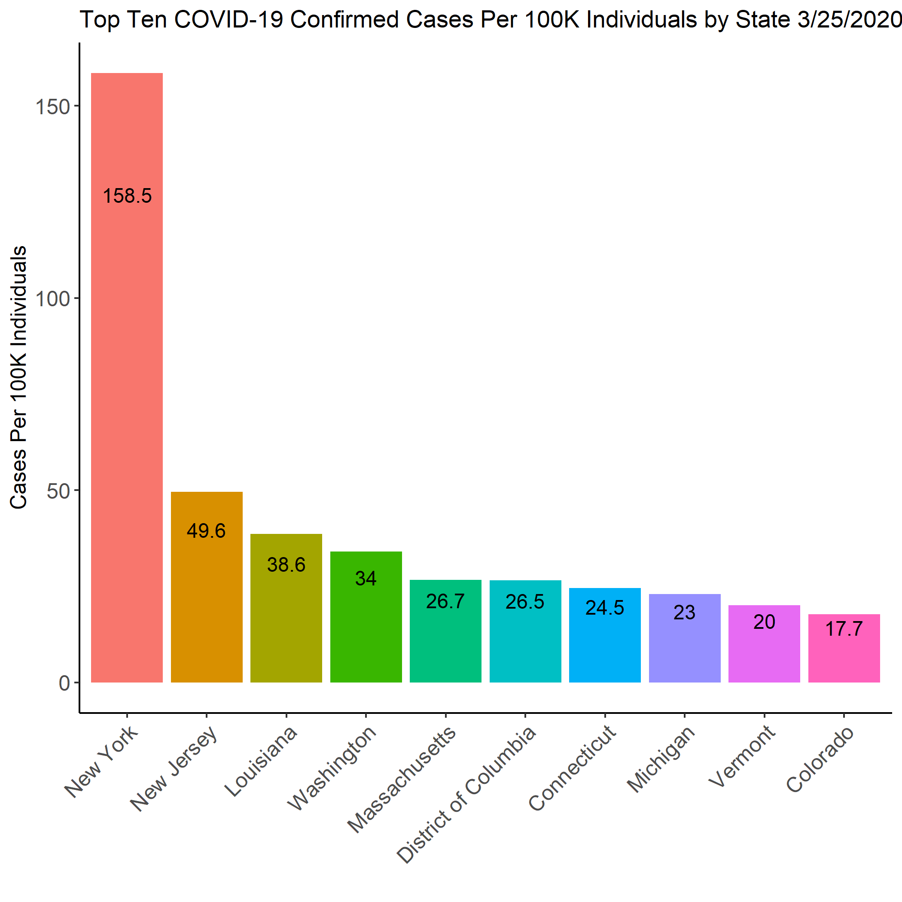
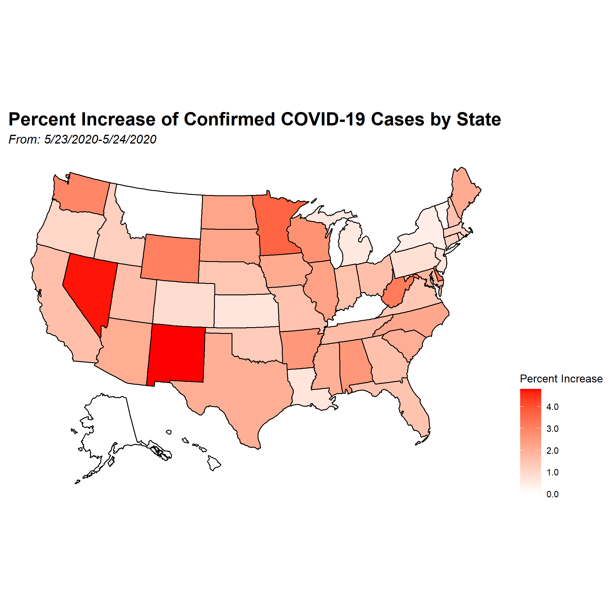
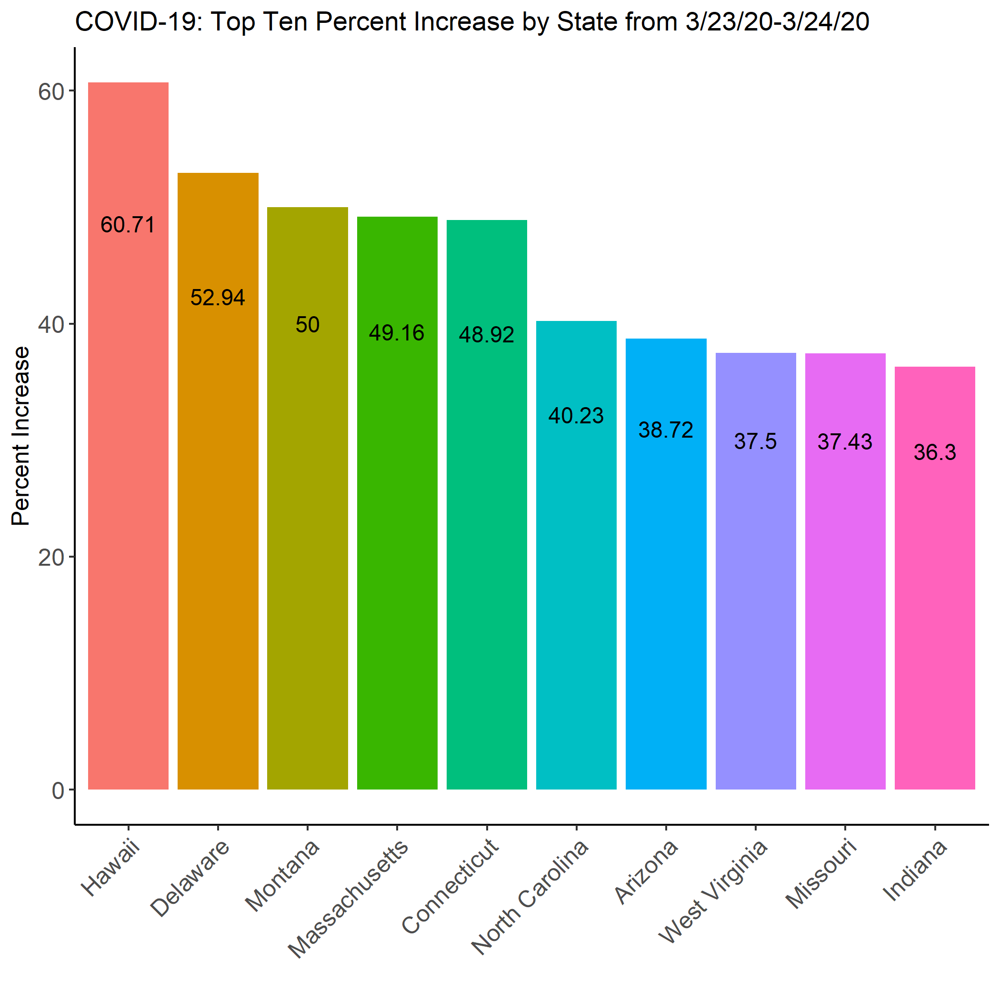
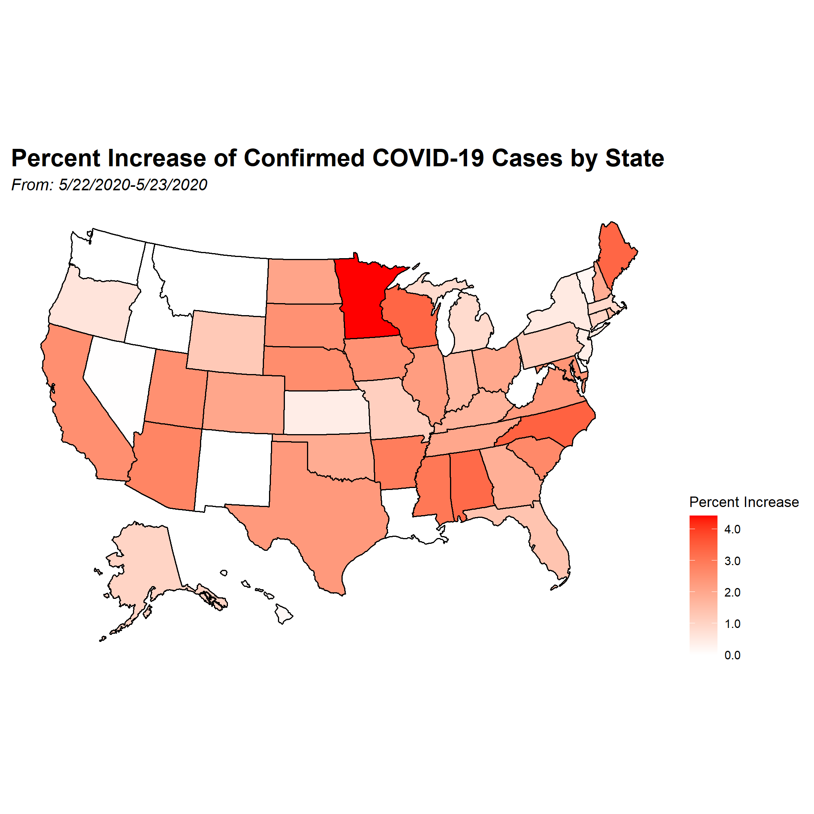
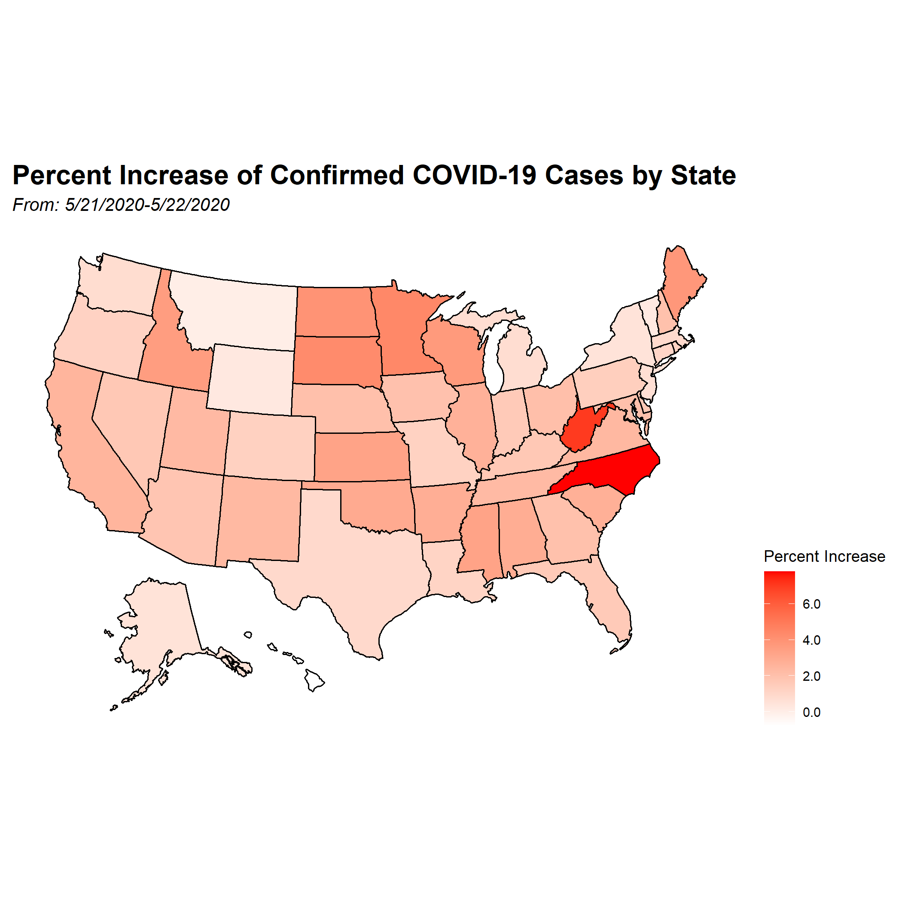
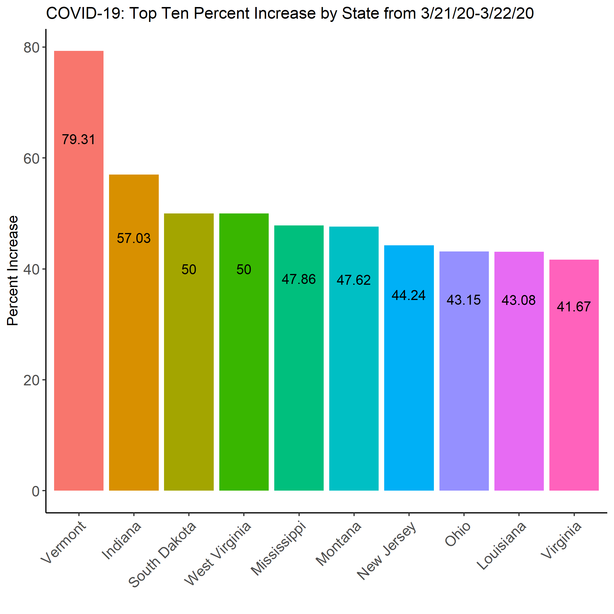

Time series heatmaps of the COVID-19 progression through the United States beginning March 21st, 2020. Raw data sourced from the Johns Hopkins Center for Systems Science and Engineering (CCSE) data repository found at [this link](https://github.com/CSSEGISandData/COVID-19). 

Data visualizations are updated daily following the public release of new raw data, and typically lag ~2 hours behind the release of new data. All raw data records are publicly available from CCSE under the data folder titled csse_covid_19_daily_reports. Time series data used in the generation of these figures consist of confirmed case reports from the contiguous US as well as Alaska and Hawaii. Washington DC cases are included in the data. All US cases registered under territories, cruise ships, and evacuees are excluded from the final data.   

Due to the changing nature of these data **please pay close attention to the heatmap scales and bar chart axes** when viewing an individual figure. As confirmed cases increase, scales and axes will also increase and should be considered when comparing multiple figures.

# Daily Confirmed Cases {.tabset}

These data illustrate the CCSE reported confirmed COVID-19 cases by state. The US heatmaps (left) show the total cases per state as a red color gradient where darker red indicates a higher number of confirmed cases within the state. Bar charts (right) illustrate the ten states with the highest number of confirmed COVID-19 cases at the point of data publication. 

## 3/25/2020

```{r 12Fig, fig.hold='hold', out.height = "50%", out.width = "50%", echo=FALSE}
knitr::include_graphics("./heat_maps/case_state_3_25.png")
knitr::include_graphics("./bar_charts/cases_3_25_bar.png")
```

## 3/24/2020

```{r 8Fig, fig.hold='hold', out.height = "50%", out.width = "50%", echo=FALSE}

knitr::include_graphics("./bar_charts/cases_3_24_bar.png")
```

## 3/23/2020

```{r 6Fig, fig.hold='hold', out.height = "50%", out.width = "50%", echo=FALSE}

knitr::include_graphics("./bar_charts/cases_3_23_bar.png")
```


## 3/22/2020

```{r 3Fig, fig.hold='hold', out.height = "50%", out.width = "50%", echo=FALSE}
knitr::include_graphics("./heat_maps/case_state_3_22.png")


```


# Cases Per 100k Population {.tabset}

These data illustrate  the number of confirmed COVID-19 by state as the number of cases per 100,000 individuals residing in that state according the US Census Bureau's 2019 July population estimate. The US heatmaps (left) show the cases per 100k individuals within a state as a red color gradient where darker red indicates a higher number of cases per 100k. Bar charts (right) illustrate  the ten states with the highest number of cases per 100k individuals at the point of data publication. State population data was obtained through the US Census Bureau website at this [link](https://www.census.gov/data/tables/time-series/demo/popest/2010s-state-total.html).

## 3/25/2020

```{r 14Fig, fig.hold='hold', out.height = "50%", out.width = "50%", echo=FALSE}
knitr::include_graphics("./heat_maps/cases_100k_3_25.png")

```

## 3/24/2020

```{r 9Fig, fig.hold='hold', out.height = "50%", out.width = "50%", echo=FALSE}

knitr::include_graphics("./bar_charts/cases_100k_3_24_bar.png")
```

## 3/23/2020

```{r 5Fig, fig.hold='hold', out.height = "50%", out.width = "50%", echo=FALSE}


```

## 3/22/2020

```{r 2Fig, fig.hold='hold', out.height = "50%", out.width = "50%", echo=FALSE}
knitr::include_graphics("./heat_maps/cases_100k_3_22.png")
knitr::include_graphics("./bar_charts/cases_100k_3_22_bar.png")

```


# Daily Percent Increase in Cases {.tabset}

These data illustrate the daily percent increases in the total number of confirmed COVID-19 cases by state. Daily percent increase compares the confirmed case total of the prior day to the new case total for the current date of the data. The US heatmaps (left) show the daily percent increase within a state as a red color gradient where darker red indicates a greater percent increase. Bar charts (right) illustrate the ten states with the highest percent increase in COVID-19 cases between the 24 hourse of measurement. Daily percent increase is strongly influenced by the availability  of COVID-19 testing and the prior number of confirmed cases within a state. Sudden spikes in percent increase on a given day may not reflect an increase in disease incidence, but rather an increase in the availability of testing. 

## 3/24/2020-3/25/2020

```{r 15Fig, fig.hold='hold', out.height = "50%", out.width = "50%", echo=FALSE}
knitr::include_graphics("./heat_maps/p_increase_cases_24_to_25.png")
knitr::include_graphics("./bar_charts/perc_increase_3_25_bar.png")
```

## 3/23/2020-3/24/2020

```{r 10Fig, fig.hold='hold', out.height = "50%", out.width = "50%", echo=FALSE}


```

## 3/22/2020-3/23/2020


```{r 4Fig, fig.hold='hold', out.height = "50%", out.width = "50%", echo=FALSE}


```

## 3/21/2020-3/22/2020

```{r 1Fig, fig.hold='hold', out.height = "50%", out.width = "50%", echo=FALSE}


```

# 36 Hour Percent Increase in Cases {.tabset}

These data illustrate the 36 hour percent increases in the total number of confirmed COVID-19 cases by state. These data show the percent increase in total cases by state over a 36 hour period expressed as the date range indicated by the specifc figure. The US heatmaps (left) show the 36 hour percent increase within a state as a red color gradient where darker red indicates a greater percent increase. Bar charts (right) illustrate the ten states with the highest percent increase in COVID-19 cases between the 36 hours of measurement.

## 3/21/20-3/24/20

```{r 16Fig, fig.hold='hold', out.height = "50%", out.width = "50%", echo=FALSE}
knitr::include_graphics("./heat_maps/p_increase_cases_21_to_24.png")
knitr::include_graphics("./bar_charts/three_day_perc_increase_3_21_to_3_24_bar.png")
```

# Contact Information

To request additional information or provide feedback on the visualizations produced here please email william.norfolk@uga.edu.


